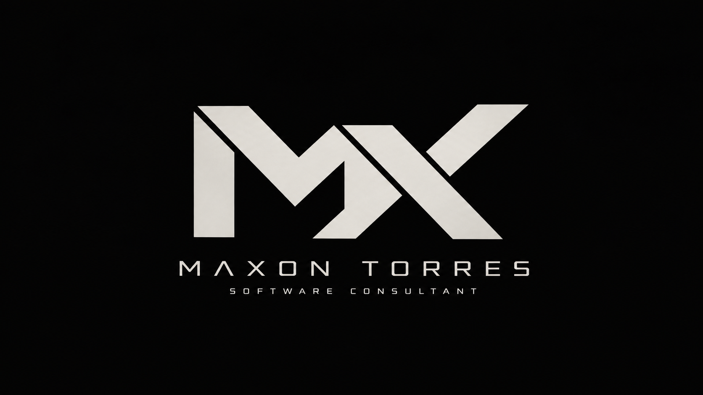

<p align="center">
  
</p>

# My terminal themes

These are the themes I use myself when working on Windows and WSL.
Give your Windows command-line window a coordinated look: a dark background, coloured
folder and Git information, and a clean place to type commands.

The main setup guide below is for **PowerShell 7 inside Windows Terminal**. The WSL theme
has [separate setup instructions](#mxwsl-crt-nx-crt-for-ubuntu-wsl).

| ID | Codename | Version | Look |
|---|---|---|---|
| `MX://PS-01` | Violet | 1.0.1 | Deep navy background, violet Git pill, minimal two-line prompt |
| `MX://WSL-CRT` | NX CRT | 1.0.0 | Near-black CRT background, cyan Bash prompt, muted teal and blue accents |


### MX://WSL-CRT: NX CRT for Ubuntu WSL

This entry captures my current **MX://WSL-CRT** Windows Terminal profile, its complete
**NX CRT** ANSI palette, the active Bash Oh My Posh prompt, and the exact `.ico` file
used by the profile. The larger matching PNG is included for previews. The original
profile uses Ubuntu, JetBrainsMono Nerd Font Mono at size 12, and Terminal's retro
effect. Its icon is shown below.


The Windows Terminal settings and WSL prompt live on different sides of the setup.
Install both parts:

1. On Windows, open PowerShell in this repository and run `.\install-wsl.ps1`. If your
   WSL distribution is not named `Ubuntu`, use `.\install-wsl.ps1 -Distribution YourDistro`.
   This installs a Windows Terminal fragment and the icon without changing your main
   `settings.json`.
2. In the WSL Bash shell, clone this repository (or use an existing checkout), then run
   these commands from its root:

   ```bash
   git clone https://github.com/maxontorres/mx-terminal-themes.git
   cd mx-terminal-themes
   mkdir -p ~/.config/oh-my-posh
   cp themes/mx-wsl-crt/mx-wsl-crt.omp.json ~/.config/oh-my-posh/
   cat themes/mx-wsl-crt/bashrc-snippet.sh >> ~/.bashrc
   ```

   Add the snippet only once. It loads the prompt when Bash opens interactively.
   [Install Oh My Posh](https://ohmyposh.dev/docs/installation/linux) in WSL first if
   the `oh-my-posh` command is unavailable.
3. Restart Windows Terminal and select **MX://WSL-CRT** from the tab menu. Set it as
   the default under **Settings → Startup** if desired. Install JetBrainsMono Nerd Font
   on Windows if the selected font is missing.

`install.ps1` and the PowerShell setup guide below apply to **MX://PS-01**.

## I don't want to read. Give me the instructions!

**On Windows, follow these steps in order.** Copy each command, paste it, press **Enter**,
and wait for it to finish. Skip installs for apps you already have.

1. Open **Windows PowerShell** from Start. Run these commands one at a time and accept the installation prompts:

   ```powershell
   winget install --id Microsoft.WindowsTerminal --exact --source winget
   winget install --id Microsoft.PowerShell --exact --source winget
   winget install --id JanDeDobbeleer.OhMyPosh --exact --source winget
   ```

2. Close your command windows. Open **Terminal** from Start, then use the arrow beside **+** to open **PowerShell** (not **Windows PowerShell**). Run:

   ```powershell
   oh-my-posh font install JetBrainsMono
   ```

3. On [this project's GitHub page](https://github.com/maxontorres/mx-terminal-themes), click **Code → Download ZIP**. Right-click the ZIP in File Explorer → **Extract All**. Open the extracted folder containing **install.ps1**, then copy its path from the address bar.

4. In your **PowerShell 7** tab, run the following. Replace the example path with the one you copied, keeping the quotation marks:

   ```powershell
   cd "C:\Users\YourName\Downloads\mx-terminal-themes-main"
   .\install.ps1
   ```

5. When the installer says **Done**, close **all Terminal windows**, reopen Terminal, and select **MX://PS-01** from the arrow beside **+**. You're ready to type commands.

Want it every time? **Settings → Startup → Default profile → MX://PS-01 → Save**.

Something failed? Go to [Troubleshooting](#troubleshooting).
Need more detail? Follow [Setup, step by step](#setup-step-by-step).

## What are all these tools?

| Tool | What it does |
|---|---|
| **Windows Terminal** | The app that displays your command-line tabs. |
| **PowerShell 7** | The program inside a tab that runs your commands. It is separate from the older **Windows PowerShell 5.1** included with Windows. |
| **[Oh My Posh](https://ohmyposh.dev/docs)** | Makes the **prompt** look nicer. The prompt is the text and symbols shown each time the terminal is ready for your next command. |
| **JetBrainsMono Nerd Font** | A font with the extra symbols this theme uses. Without it, some symbols may appear as squares. |
| **This project** | Supplies matching settings for those tools and an installer that connects them. |

## Setup, step by step

You need a Windows PC and an internet connection. Run each command below by copying it,
pasting it into the indicated window, and pressing **Enter**. Wait for it to finish before
running the next command. Commands inside the code boxes are the only text you need to copy.

### 1. Install the apps

Open **Start**, search for **Windows PowerShell**, and open it. This older version is fine
for this first step. Run these commands one at a time:

```powershell
winget install --id Microsoft.WindowsTerminal --exact --source winget
winget install --id Microsoft.PowerShell --exact --source winget
winget install --id JanDeDobbeleer.OhMyPosh --exact --source winget
```

If an app is already installed, you can continue. Accept any installation agreements or
Windows permission prompts needed to install the apps.

`winget` is Windows' app installer. If Windows says it is not recognised, install or update
**App Installer** from the Microsoft Store, then close and reopen your command window.

The commands above follow the official installation guides for
[PowerShell](https://learn.microsoft.com/en-us/powershell/scripting/install/installing-powershell-on-windows)
and [Oh My Posh](https://ohmyposh.dev/docs/installation/windows).

### 2. Open PowerShell 7 in Windows Terminal

Close your command windows, then open **Terminal** from the Start menu. Click the small
down arrow next to the **+** button and choose **PowerShell**. Do not choose **Windows PowerShell**.

Check that you opened the right version:

```powershell
$PSVersionTable.PSVersion
```

The number under **Major** must be **7 or higher**. If it says **5**, you are in the older
Windows PowerShell. Close that tab and choose **PowerShell** from the tab menu.

**Use this PowerShell 7 tab for all remaining commands.**

### 3. Install the font

```powershell
oh-my-posh font install JetBrainsMono
```

Let the font installation finish and accept any permission prompt it requires.
The MX terminal profile will select **JetBrainsMono NFM** for you when you open it.
See the [Oh My Posh font guide](https://ohmyposh.dev/docs/installation/fonts) for more details.

### 4. Download this project

**No Git required:**

1. Open [this project's GitHub page](https://github.com/maxontorres/mx-terminal-themes).
2. Click the green **Code** button, then **Download ZIP**.
3. In File Explorer, right-click the downloaded ZIP and choose **Extract All**. Extract it to a folder you can find again, such as Downloads.
4. Open the extracted project folder. You should see **install.ps1**, **README.md**, and the **themes** folder together. If you only see another folder, open that folder first.
5. Click File Explorer's address bar and copy the folder's full path.
6. In your PowerShell 7 tab, type `cd ` followed by that path in quotation marks, then press Enter. For example (replace this example with your own path):

```powershell
cd "C:\Users\YourName\Downloads\mx-terminal-themes-main"
```

**If you already use Git**, you can use these commands instead of downloading a ZIP:

```powershell
git clone https://github.com/maxontorres/mx-terminal-themes
cd mx-terminal-themes
```

### 5. Install the theme

Run this from the project folder you opened in step 4:

```powershell
.\install.ps1
```

Wait for the message beginning with **Done. Restart Windows Terminal**.
If you see a warning that Oh My Posh or the font is missing, finish the corresponding
setup step above before continuing. The theme installer does not install those dependencies.

If PowerShell blocks the script, see **Troubleshooting** below.

### 6. Open your themed tab

Close **all Windows Terminal windows**, then reopen Terminal. Click the down arrow next
to **+** and select **MX://PS-01**.

You should now see the dark background from the screenshot, your current folder above
a `❯` symbol, and a new line where you can type commands. The purple Git label appears
only when you are inside a Git project and Git is installed; you do not need Git for
the rest of the theme to work.

To use this tab automatically, open Terminal's **Settings → Startup**, set
**Default profile** to **MX://PS-01**, and click **Save**.

## What the prompt tells you

- **Folder path:** the folder your commands will run in.
- **Purple Git label:** the current branch when you are in a Git project. An amber dot means there are changes that have not been committed (saved to Git's history).
- **Red `✕` followed by a number:** the last command reported a failure. The number is its exit code.
- **`❯`:** the place to type your next command.
- **`Admin` or `User` in the tab title:** whether that PowerShell session is running with administrator privileges. The title also attempts to show the terminal profile name; it may fall back to `PowerShell`.

## Troubleshooting

### “oh-my-posh is not recognised”

Close all Terminal windows and reopen Terminal so it picks up the newly installed app.
If the error remains, run the Oh My Posh installation command from step 1 again.

### “Running scripts is disabled on this system”

PowerShell has a setting that controls whether scripts can run. To allow local scripts
for your Windows user, run:

```powershell
Set-ExecutionPolicy -Scope CurrentUser -ExecutionPolicy RemoteSigned
```

Confirm with **Y** if asked, then retry `.\install.ps1`. This setting also allows the
PowerShell startup script that loads your prompt to run in future tabs.
See Microsoft's [execution policy documentation](https://learn.microsoft.com/en-us/powershell/module/microsoft.powershell.core/about/about_execution_policies).
If a work or school policy prevents the change, contact your administrator.

### “install.ps1 is not digitally signed”

If you downloaded the ZIP, Windows may have marked the installer as downloaded from the
internet. After reviewing the script, run this from the project folder and retry installation:

```powershell
Unblock-File .\install.ps1
.\install.ps1
```

### “install.ps1 is not recognised” or “cannot find path”

Make sure you extracted the ZIP and used `cd` to enter the folder containing `install.ps1`.
Use `.\install.ps1` exactly, including the dot and backslash. Do not run it from inside the ZIP.

### Symbols look like squares, or the font looks wrong

Run the font command from step 3, then restart Terminal. In **Settings → Profiles →
MX://PS-01 → Appearance**, check that **Font face** is **JetBrainsMono NFM** and save.

### The MX://PS-01 tab is missing, or the prompt still looks unchanged

Check that you are using Windows Terminal and PowerShell 7, then run the installer again
from the project folder and restart all Terminal windows. You can check that Oh My Posh
is available by running `oh-my-posh version`.

If you already customised your PowerShell startup script, another prompt setup in that
script may conflict with this theme. The installer prints the startup script's location
on its `profile ->` line.

## What the installer changes

The installer sets up the theme for your current Windows user:

- Copies the Oh My Posh theme to `.config\oh-my-posh` inside your user folder.
- Adds the **MX://PS-01** tab option, icon, font settings, and colour scheme to Windows Terminal through a separate settings file. It does not edit Terminal's main `settings.json` file.
- Adds a marked block to your **PowerShell 7 profile**: the startup script PowerShell runs when you open a session. The block starts with `# BEGIN MX://PS` and ends with `# END MX://PS`.

**The prompt setup also affects other ordinary PowerShell 7 tabs that load this same
startup script.** The background and font settings belong to the MX://PS-01 terminal profile.

Before changing an existing PowerShell startup script or replacing an existing Oh My Posh
theme file, the installer saves a dated `.bak` copy beside it. The installed Terminal
settings file and icon are overwritten without backups when you reinstall.

## Remove the theme

Open a regular **PowerShell 7** tab in Terminal, then use `cd` to return to the project
folder from step 4. Run:

```powershell
.\install.ps1 -Uninstall
```

This removes the installed MX theme files, terminal profile, and marked startup block.
It leaves PowerShell, Oh My Posh, the font, and any backup files installed. It does not
automatically restore an older prompt from a backup.

If you made MX://PS-01 your default profile, choose **PowerShell** in
**Settings → Startup → Default profile** and save. Close and reopen Terminal.

## Naming and versions

Each theme has an ID (`MX://PS-01`), a codename (`Violet`) and a version. Releases are tagged
`mx-ps-01/v1.0.1`: the first number changes with the look, the second with additions, the third with fixes.

## License

MIT
