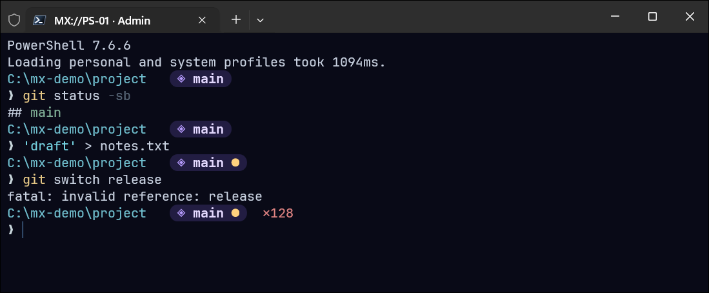

# MX terminal themes

Themes for PowerShell 7 in Windows Terminal: a colour scheme, a terminal profile and an
[oh-my-posh](https://ohmyposh.dev) prompt that belong together.

| ID | Codename | Version | Look |
|---|---|---|---|
| `MX://PS-01` | Violet | 1.0.1 | Deep navy background, violet Git pill, minimal two-line prompt |

<!-- screenshot: add docs/mx-ps-01.png and uncomment

-->

## What you get

```
C:\Users\you\code\project    ◈ main ●
❯
```

- Full path, then a Git "pill" with the branch; an amber dot appears when there are uncommitted changes.
- A red `✕<code>` after a command that failed.
- The tab title shows the terminal profile and privilege level: `MX://PS-01 · Admin` or `MX://PS-01 · User`.

## Requirements

- Windows Terminal
- PowerShell 7
- oh-my-posh: `winget install JanDeDobbeleer.OhMyPosh --source winget`
- JetBrainsMono Nerd Font: `oh-my-posh font install JetBrainsMono`

If the prompt feels slow: the packaged (winget / Microsoft Store) build of oh-my-posh can take
about 0.3 s to start on every prompt. The standalone `posh-windows-amd64.exe` from the
[oh-my-posh releases](https://github.com/JanDeDobbeleer/oh-my-posh/releases), saved as
`oh-my-posh.exe` in a folder on your `PATH`, starts roughly ten times faster.

## Install

```powershell
git clone https://github.com/maxontorres/mx-terminal-themes
cd mx-terminal-themes
./install.ps1
```

Then restart Windows Terminal and choose the **MX://PS-01** profile.

The installer:

- copies the prompt theme to `~\.config\oh-my-posh\`,
- adds a Windows Terminal fragment (profile + colour scheme) without touching your `settings.json`,
- adds a block between `# BEGIN MX://PS` and `# END MX://PS` to your PowerShell profile.

Files it replaces are backed up next to the original with a `.bak` suffix.

## Uninstall

```powershell
./install.ps1 -Uninstall
```

## Naming and versions

Each theme has an ID (`MX://PS-01`), a codename (`Violet`) and a version. Releases are tagged
`mx-ps-01/v1.0.1`: the first number changes with the look, the second with additions, the third with fixes.

## License

MIT
